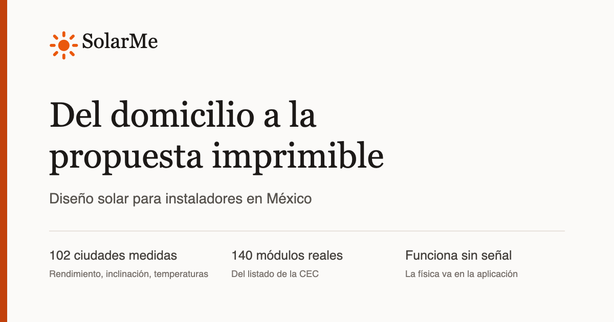

# SolarMe

**Del domicilio a la propuesta imprimible.** Herramienta web para instaladores solares en México:
se escribe una dirección y sale un diseño con la física de esa ciudad, el módulo recomendado, las
series, las protecciones y una propuesta lista para imprimir y entregar al cliente.

👉 **[Abrir la aplicación](https://danielaguilarj.github.io/SOLARME/)**



---

## Qué hace hoy

| | |
|---|---|
| **Resuelve la ciudad** | 102 sitios medidos en los 32 estados: rendimiento anual, inclinación y orientación óptimas, y las temperaturas extremas registradas ahí. Vienen de PVGIS y NASA POWER. |
| **Recomienda el módulo** | 140 módulos del listado de la CEC, con su voltaje, corriente y coeficiente térmico reales. Se filtran y se comparan lado a lado. |
| **Coloca los módulos** | El instalador traza el contorno del techo y la aplicación reparte las filas respetando la separación que evita que una fila dé sombra a la siguiente en el solsticio. |
| **Dimensiona lo eléctrico** | Series por voltaje en frío, calibre del conductor con corrección por temperatura y agrupamiento, protección contra sobrecorriente y desconectador. Cita el NEC. |
| **Calcula el dinero** | Tarifa del recibo, ahorro mensual, costo del sistema y retorno. Lo que es estimación lo dice en la propia cifra. |
| **Emite la propuesta** | Un documento imprimible con el domicilio, el arreglo, la producción mes a mes y el desglose. |
| **Sale con tu nombre** | La propuesta lleva la razón social, el teléfono, el correo y el registro del instalador, y con esos mismos datos el aviso de privacidad queda completo. Se piden una vez. |
| **Funciona sin señal** | Una vez cargada, la física, el catálogo y los proyectos viven en el dispositivo. Se instala en el teléfono desde la propia aplicación y abre a pantalla completa, sin barra de direcciones. |

## Qué **no** hace todavía

Vale la pena decirlo antes de que alguien lo descubra usándola:

- **No hay imagen satelital del techo.** El contorno lo traza el instalador. La pantalla para
  confirmar el punto exacto ya está construida y espera una clave de proveedor de mosaicos; sin
  ella dibuja una cuadrícula, lo dice, y deja ajustar el punto igual.
- **No hay servidor ni cuenta de usuario.** Todo se guarda en el navegador de quien la usa. Hay
  respaldo a archivo e importación para pasar la cartera de un dispositivo a otro.
- **El aviso de privacidad se completa con los datos del negocio**, que la aplicación no puede
  saber por su cuenta. Mientras falten, lo dice en pantalla y marca los huecos; en cuanto se
  ponen, queda entregable. Conviene revisar el texto con quien lleve los temas legales.

## Cómo se corre

```bash
cd app
npm ci
npm run dev     # desarrollo
npm run build   # lint + tipos + pruebas + compilación
```

`npm run build` corre oxlint, `tsc`, más de mil pruebas y luego compila. Es el mismo comando que
ejecuta la publicación, así que un cambio que rompa algo no llega a producción.

## Cómo está organizado

```
app/src/lib/          la física y las reglas: solar, sombreado, series, conductor, protecciones,
                      precios, propuesta. Cada archivo con su prueba al lado.
app/src/views/        las pantallas: inicio, análisis, cartera.
app/src/components/   catálogo, techo, unifilar, mapa, comparador, avisos.
app/src/data/         sites.json (102 sitios medidos) y panels.json (140 módulos de la CEC).
scraper/              los guiones de Python que midieron los datos, para poder repetir la medición.
research/             lo que se investigó del mercado y de las fuentes disponibles.
```

## De dónde salen los datos

- **Radiación, inclinación óptima y pérdidas**: PVGIS (Comisión Europea).
- **Temperaturas extremas y media**: NASA POWER.
- **Módulos**: listado de módulos de la California Energy Commission.
- **Direcciones**: Nominatim, de OpenStreetMap. Es lo único que sale del dispositivo.
- **Reglas eléctricas**: NEC, artículo 690.

Las cifras que no salen de un dato medido llevan su etiqueta en la interfaz.
